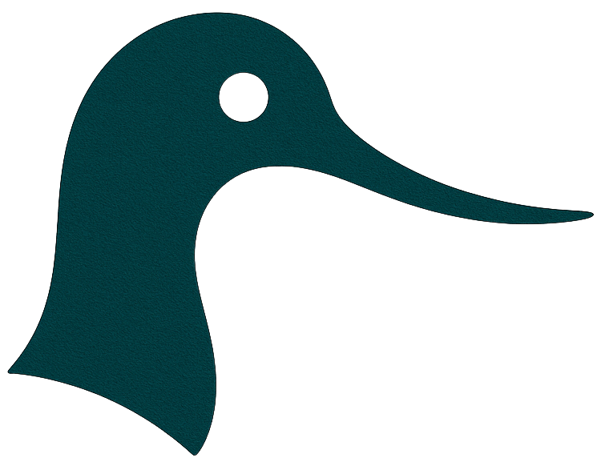

#  robbuffet

[](https://pypi.org/project/robbuffet/)
[](https://pypi.org/project/robbuffet/)
[](https://github.com/yashpatel5400/robbuffet/actions/workflows/ci.yml)
[](https://ypatel.io/robbuffet/)

Conformal prediction + robust decision making with PyTorch predictors and CVXPY optimizers.

## Install
- From PyPI:
  ```bash
  pip install robbuffet
  ```
- From source:
  ```bash
  git clone https://github.com/yashpatel5400/robbuffet
  cd robbuffet
  pip install .
  ```
- Editable + dev extras:
  ```bash
  pip install -e .[dev]
  ```

## Submodules
This repo uses the `DCRNN_PyTorch` submodule for the METR-LA shortest-path example. Clone with:
```bash
git clone --recurse-submodules https://github.com/yashpatel5400/robbuffet
```
or, if already cloned:
```bash
git submodule update --init --recursive
```
For the METR-LA example, generate predictions via:
```bash
cd examples/DCRNN_PyTorch
python run_demo_pytorch.py --config_filename=data/model/pretrained/METR-LA/config.yaml
cd ../..
```
This writes `data/dcrnn_predictions_pytorch.npz` that the example consumes.

## What this package does
- Calibrate PyTorch predictors with split conformal prediction and geometry-aware score functions.
- Produce prediction regions (convex or unions) that can be sampled, visualized (1D/2D), or passed to downstream optimizers.
- Build deterministic or scenario-based robust decision problems that respect conformal regions.

Supported scores/geometries with closed-form robustification:
- L2 residual (`L2Score`) → L2 ball.
- L1 residual (`L1Score`) → L1 ball.
- Linf residual (`LinfScore`) → Linf ball (hypercube).
- Mahalanobis residual (`MahalanobisScore`) → ellipsoid.

## Quickstart (split conformal, L2 residual score)
```python
import torch
from torch.utils.data import DataLoader, TensorDataset
from robbuffet import L2Score, SplitConformalCalibrator

# toy predictor
model = torch.nn.Linear(2, 2)

# calibration data loader
x_cal = torch.randn(200, 2)
y_cal = x_cal + 0.1 * torch.randn_like(x_cal)
cal_loader = DataLoader(TensorDataset(x_cal, y_cal), batch_size=32)

cal = SplitConformalCalibrator(model, L2Score(), cal_loader)
alpha = 0.1
cal.calibrate(alpha=alpha)

x_new = torch.randn(1, 2)
region = cal.predict_region(x_new)
print("center:", region.center, "radius:", region.radius)
```

## Visualization
```python
from robbuffet import vis
import matplotlib.pyplot as plt
vis.plot_region_2d(region, grid_limits=((-1, 1), (-1, 1)), resolution=200)
plt.show()
```

## Affine Robust Solver
For linear/affine dependence on the uncertain parameter `theta`, build a predictor + score and conformal region, then use support functions:
```python
import cvxpy as cp
import numpy as np
import torch
from torch.utils.data import TensorDataset, DataLoader
from robbuffet import L2Score, SplitConformalCalibrator, AffineRobustSolver

# toy predictor
model = torch.nn.Linear(2, 2)
x_cal = torch.randn(200, 2)
y_cal = x_cal + 0.1 * torch.randn_like(x_cal)
cal_loader = DataLoader(TensorDataset(x_cal, y_cal), batch_size=32)

cal = SplitConformalCalibrator(model, L2Score(), cal_loader)
q = cal.calibrate(alpha=0.1)
region = cal.predict_region(torch.zeros(1, 2))  # example point

def base_obj(w):
    return cp.norm(w, 2)

def theta_dir(w):
    return w

def robust_constraints(w):
    # Example affine constraint <w, theta> <= 0.5 for all theta in region
    return [(w, 0.5)]

solver = AffineRobustSolver(
    decision_shape=(2,),
    region=region,
    base_objective_fn=base_obj,
    theta_direction_fn=theta_dir,
    constraints_fn=lambda w: [],
    robust_constraints_fn=robust_constraints,
)
w_star, status = solver.solve()
print("status:", status, "w*:", w_star)
```

`AffineRobustSolver` assumes the uncertain parameter enters the problem **affinely**. The robustified optimization has the form:

$\min_{w} \quad g(w) + \sup_{\theta \in \mathcal{C}(x)} \langle d(w), \theta \rangle$  
$\text{s.t. } h_i(w) \le 0, \quad \langle a_j(w), \theta \rangle \le b_j(w) \quad\quad \forall \theta \in \mathcal{C}(x).$

Here:  
- $g(w)$ is `base_objective_fn(w)`; $h_i(w)$ and $b_j(w)$ come from `constraints_fn`.  
- The dependence on $\theta$ is affine: `theta_direction_fn(w)` corresponds to $d(w)$ in the objective, and each pair $(a_j(w), b_j(w))$ comes from `robust_constraints_fn`.  
- $\mathcal{C}(x)$ is the conformal region returned by `cal.predict_region(...)`.  

`AffineRobustSolver` replaces the affine $\theta$ terms with support functions $h_{\mathcal{C}}(\cdot)$; non-affine $\theta$ dependence is **not** supported. Use the Danskin or sampling-based approaches when the uncertainty enters non-affinely or the region is nonconvex/union and you prefer gradient-based optimization.

## Gradient-Based (Danskin) Solver
For nonconvex or union regions, get a conformal region from a predictor/score, then use the Danskin optimizer:
```python
import numpy as np
import torch
from robbuffet import DanskinRobustOptimizer, SplitConformalCalibrator
from robbuffet.scores import GPCPScore
from torch.utils.data import DataLoader, TensorDataset

# toy sampler predictor: returns K samples (K, batch, d)
def sampler(x):
    base = torch.randn(5, x.shape[0], 2)
    return base

score_fn = GPCPScore(sampler)
cal = SplitConformalCalibrator(sampler, score_fn, DataLoader(TensorDataset(torch.zeros(10, 1), torch.zeros(10, 1)), batch_size=2))
q = cal.calibrate(alpha=0.1)
region = cal.predict_region(torch.zeros(1, 1))

def inner(theta_var, w_np):
    return theta_var @ w_np

def value_and_grad(w_np, theta_np):
    return float(theta_np @ w_np), np.array(theta_np, dtype=float)

project = lambda w_vec: np.clip(w_vec, -1, 1)
opt = DanskinRobustOptimizer(region, nom_obj=inner, value_and_grad_fn=value_and_grad, project_fn=project)
w_star, _ = opt.solve(w0=np.zeros(2), step_size=0.1, max_iters=100)
print("Danskin w*:", w_star)
```

## Examples
- `examples/robust_shortest_path_metrla.py` — robust shortest path on METR-LA with conformalized DCRNN_PyTorch forecasts (needs `examples/DCRNN_PyTorch` submodule + predictions NPZ).
- `examples/robust_bike_newsvendor.py` — conformal calibration on UCI Bike Sharing demand + robust newsvendor decisions.
- `examples/robust_capacity_planning.py` — synthetic arrival forecasting + robust server capacity sizing under conformal demand intervals.
- `examples/robust_fractional_knapsack.py` — SBIBM simulator + flow-based posterior samples for robust fractional knapsack.

Run with `python examples/<script>.py`. The METR-LA script assumes you have generated `examples/DCRNN_PyTorch/data/dcrnn_predictions_pytorch.npz` (see Submodules above).

## Trial runner
Use `scripts/run_trials.py` to run an example multiple times, cache results, and compare robust vs nominal:
```bash
# absolute objectives (no normalization)
python scripts/run_trials.py --example robust_bike_newsvendor.py --trials 5 --alpha 0.1

# relative gaps (requires avg_cost_oracle from the example)
python scripts/run_trials.py --example robust_bike_newsvendor.py --trials 5 --alpha 0.1 --relative
```
Outputs mean/std and a paired t-test (robust < nominal) when scipy is available. Caches results in `.cache/run_trials.json`.

## Extending
- Add new `ScoreFunction` implementations that expose their induced region geometry via `build_region`.
- For non-convex regions, return `PredictionRegion.union([...])` so optimizers can decompose or sample.
- Use the scenario optimizer as a default inner-approximation; for affine cases use the deterministic robustifiers above.

## Contributing
Please open issues for bugs/feature requests and PRs for fixes/additions. See CONTRIBUTING.md for guidelines.

## Citation
If you use Robbuffet in academic work, please cite:
```
@software{robbuffet,
  title = {Robbuffet: Conformal prediction and robust decision making},
  author = {Yash Patel},
  year = {2025},
  url = {https://github.com/yashpatel5400/robbuffet}
}
```

This package is built atop a line of academic work developing the conformal decision-making framework. For the original academic works, refer to the following works:

```
@inproceedings{patel2024conformal,
  title={Conformal contextual robust optimization},
  author={Patel, Yash P and Rayan, Sahana and Tewari, Ambuj},
  booktitle={International Conference on Artificial Intelligence and Statistics},
  pages={2485--2493},
  year={2024},
  organization={PMLR}
}

@inproceedings{patel2024variational,
  title={Variational Inference with Coverage Guarantees in Simulation-Based Inference},
  author={Patel, Yash and Mcnamara, Declan and Loper, Jackson and Regier, Jeffrey and Tewari, Ambuj},
  booktitle={International Conference on Machine Learning},
  pages={39861--39888},
  year={2024},
  organization={PMLR}
}

@article{patel2024conformal,
  title={Conformal robust control of linear systems},
  author={Patel, Yash and Rayan, Sahana and Tewari, Ambuj},
  journal={arXiv preprint arXiv:2405.16250},
  year={2024}
}
```
